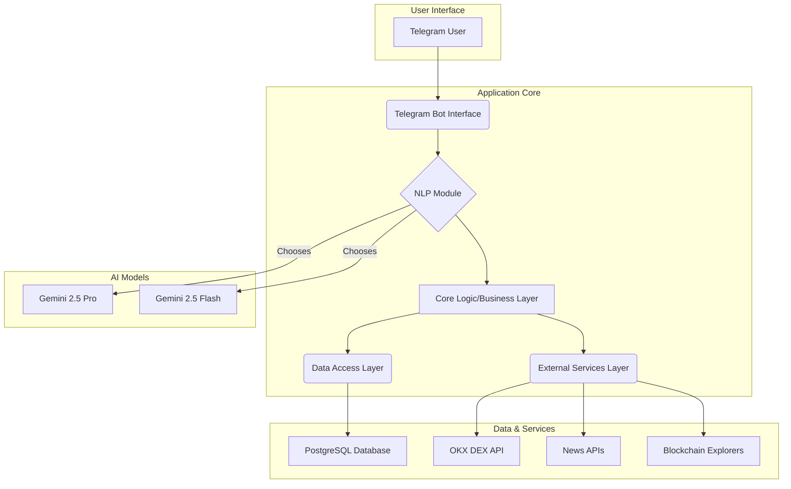
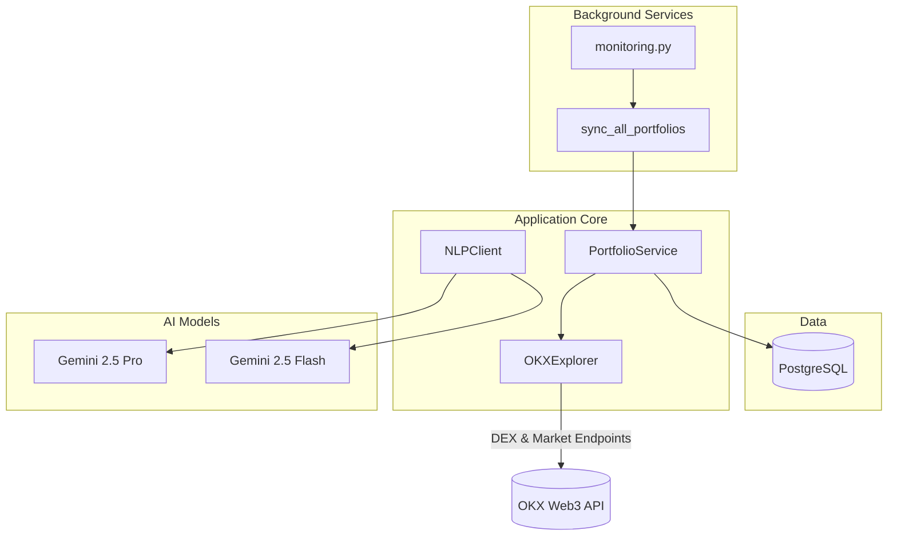

# How It Works: A Technical Deep Dive into Esther

## 1. Introduction
This document provides a detailed technical explanation of the Esther AI Agent's architecture, data flow, and core components. It is intended for developers and technical stakeholders to understand the inner workings of the system.

## 2. Architectural Overview
Esther is a modular, asynchronous Python application designed for scalability and maintainability. The architecture separates concerns into distinct layers, ensuring that each part of the system has a single responsibility.



## 3. Data Flow: A User Command's Journey

Here is the step-by-step journey of a user command, from Telegram to execution and back:

1.  **Message Reception**: The **Telegram Bot Interface** receives a message from a user. If a webhook is configured, Telegram sends an HTTP POST request to the `/webhook` endpoint of the **FastAPI application**. Otherwise, the bot uses long polling to fetch updates.
2.  **NLP Processing**: The message is passed to the **NLP Module**.
    *   A preliminary check determines the likely complexity of the query.
    *   **Strategy Pattern**: Based on complexity, the system selects either **Gemini Flash** (for simple requests like "price of ETH") or **Gemini Pro** (for complex requests like "buy 0.5 ETH if...").
    *   The chosen Gemini model processes the text, returning a structured object containing the user's `intent` (e.g., `buy_token`, `sell_token`, `set_stop_loss`) and `entities` (e.g., `{token: 'ETH', amount: 0.5, currency: 'USDT'}`).
3.  **Core Logic Orchestration**: The **Core Logic Layer** receives the structured `intent` and `entities`.
    *   It retrieves the user's profile and encrypted API keys from the **PostgreSQL Database** via the **Data Access Layer**.
    *   **Command Pattern**: It instantiates a command object (e.g., `BuyCommand`) with the necessary data.
4.  **Pre-execution & Confirmation (Conversation Flow)**:
    *   For transactional commands like `buy_token` or `sell_token`, the **Core Logic Layer** initiates a multi-step conversation using Telegram's `ConversationHandler`.
    *   **Quote Fetch**: It first calls the **External Services Layer** to get a live quote from the **OKX DEX API**. For cross-chain swaps, it includes the `source_chain` and `destination_chain` in the request. The `source_chain` is used to determine the `chainId` for the API call. This ensures the user sees up-to-date pricing.
    *   **Confirmation Prompt**: A detailed confirmation message is constructed, including the estimated amount of the token to be received and the source and destination chains. This message is sent to the user with inline keyboard buttons ("✅ Confirm", "❌ Cancel").
    *   **State Management**: The `ConversationHandler` transitions the user's chat into a specific state (`AWAIT_CONFIRMATION`). In this state, the bot will only listen for the user to click one of the confirmation buttons. The details of the pending swap are stored in the `context.user_data` dictionary to maintain state.
5.  **Execution**:
    *   **User Action**: The user clicks either "Confirm" or "Cancel".
    *   **Callback Handling**: A `CallbackQueryHandler` captures the user's choice.
    *   **Swap Execution**: If the user confirms, the `confirm_swap` function is called. It retrieves the swap details from `context.user_data` and calls the `execute_swap` method in the **External Services Layer**.
    *   **Dry Run vs. Live Mode**: The `confirm_swap` function now checks if `live_trading_enabled` is `True` for the user.
        *   If `dry_run` is `True` (default), the function returns a simulated success message with the quote data, and no transaction is sent.
        *   If `live_trading_enabled` is `True`, the function resolves the user's `default_wallet_id`, fetches the corresponding wallet, decrypts the private key in-memory, and uses it to sign and execute a real transaction via the OKX DEX aggregator.
        *   If `live_trading_enabled` is `False`, the bot informs the user that live trading is disabled and provides instructions on how to enable it.
    *   **Cancellation**: If the user cancels, the `cancel_swap` function is called, the conversation ends, and the stored swap details are cleared.
6.  **Response and Logging**:
    *   The result of the quote API call is received.
    *   A final status message is sent to the user (e.g., "Trade executed successfully" or "Trade failed: Insufficient funds").
    *   All outgoing requests to the OKX API are now logged, showing the full URL for improved transparency and debugging.
    *   The transaction details are logged in the **PostgreSQL Database** for the user's history.
7.  **Background Monitoring (Price Alerts)**:
    *   A separate, continuously running process (`src/monitoring.py`) handles real-time price alerts.
    *   **Periodic Checks**: Every 60 seconds, this process queries the `alerts` table in the **PostgreSQL Database** for all active alerts.
    *   **Live Price Fetch**: For each active alert, it calls the **OKX DEX API** to get the current price of the monitored token. It dynamically calculates the amount to quote based on the token's decimals, ensuring an accurate price check for any token.
    *   **Condition Check**: It compares the live price against the alert's target price and condition (e.g., `current_price > target_price`).
    *   **Notification**: If an alert is triggered, the monitoring service uses the **Telegram Bot API** to send a direct message to the user.
    *   **Deactivation**: Once an alert is triggered, it is marked as inactive in the database to prevent duplicate notifications.

## 4. Conversational NLP & Natural Language Understanding

Esther has evolved from a command-driven bot to a sophisticated conversational AI that understands natural language. This transformation involves several key components:

### 4.1 Intent Recognition System
The NLP module uses Google's Gemini models to parse user messages into structured intents and entities:

**Supported Intents**:
- `greeting`: "Hello", "Hi Esther", "Good morning"
- `get_price`: "What's the price of BTC?", "How much is ETH worth?"
- `buy_token`: "Buy 0.1 ETH with USDT", "I want to purchase some Bitcoin"
- `sell_token`: "Sell 0.5 ETH for USDC", "I need to sell my tokens"
- `set_stop_loss`: "Set stop loss for BTC at 60000"
- `set_take_profit`: "Set take profit for ETH at 3500"
- `list_wallets`: "Show me my wallets", "List all my wallets"
- `add_wallet`: "I want to add a wallet", "Add a new wallet"
- `show_portfolio`: "What's in my portfolio?", "Show me my assets"
- `get_insights`: "Give me market insights", "What's the market analysis?"
- `execute_rebalance`: "Rebalance my portfolio", "Execute the rebalance plan"
- `get_price_chart`: "Show me the price chart for BTC", "Chart for ETH over 7d"

### 4.2 Two-Tier Model Selection Strategy
Esther intelligently chooses between Gemini models based on task complexity:

**Gemini 2.5 Flash** (Fast, Cost-Effective):
- Initial intent recognition for all queries
- Simple, single-intent requests
- Basic conversational responses
- Portfolio and wallet management queries

**Gemini 2.5 Pro** (Powerful, Comprehensive):
- Complex trading decisions with multiple conditions
- In-depth market analysis and insights generation
- Personalized recommendations requiring portfolio analysis
- Multi-step reasoning tasks

### 4.3 Lazy Model Initialization
The `NLPClient` uses lazy initialization to optimize resource usage:
- Models are only instantiated when first accessed
- Reduces startup time and memory footprint
- Enables efficient model switching based on task requirements

### 4.4 Conversational Command Flow
1. **Message Reception**: User sends natural language message
2. **Initial Parsing**: Gemini Flash quickly identifies basic intent
3. **Complex Task Escalation**: For complex tasks, Gemini Pro re-parses with deeper understanding
4. **Intent Routing**: System routes to appropriate handler function
5. **Response Generation**: Contextual, helpful responses maintain conversation flow

## 5. Gemini Model Allocation Strategy
The choice between Gemini Pro and Flash is dynamic and crucial for balancing performance and cost.

-   **Gemini Flash is used for**:
    -   Initial greetings and simple conversational turns.
    -   Single-intent, low-complexity queries: "What is the price of BTC?", "What is DeFi?".
    -   Simple, single-condition alerts: "Alert me if BTC > $70,000".
    -   Portfolio and wallet management: "Show me my wallets", "What's in my portfolio?"
    -   Basic intent recognition for all incoming messages.
-   **Gemini Pro is used for**:
    -   Complex, multi-intent, or conditional commands: "Buy 0.1 ETH with USDT if the price is below $2000".
    -   In-depth market analysis and trend generation.
    -   Personalized recommendations that require analyzing user history and portfolio data.
    -   Nuanced sentiment analysis of news articles.
    -   Generating detailed, structured educational content.
    -   Complex trading decisions requiring market analysis.

## 6. Security Design
Security is paramount. The following measures are integral to the design:
-   **Environment Variables**: All system-level API keys and secrets are managed exclusively through environment variables and are never hardcoded.
-   **Secure Web App for Private Keys**: To enhance security, the bot uses a Telegram Web App for private key submission. Instead of sending sensitive data through chat, users are directed to a secure, isolated web interface. This prevents private keys from being stored in chat history and adds a layer of protection against unauthorized access.
-   **Database Encryption**: User-specific sensitive data, particularly OKX DEX API keys and wallet private keys, are encrypted using a strong algorithm (e.g., AES-256) before being stored in the PostgreSQL database. The encryption key itself is managed as a secure environment variable.
-   **In-Memory Decryption**: Private keys are only decrypted in-memory at the moment of transaction signing and are never stored in plaintext.
-   **User-Controlled Live Trading**: Live trading is disabled by default. Users must explicitly enable it and set a default wallet, giving them full control over their funds.
-   **Immutable Transaction Confirmation**: The pre-execution confirmation step is a mandatory, non-skippable part of the workflow for any action that modifies a user's assets.
-   **Principle of Least Privilege**: The OKX DEX API keys requested from the user should have the minimum required permissions for the bot's functionality.
-   **Database Schema Migration**: Automatic schema initialization ensures the database structure is always up-to-date, preventing runtime errors.

## 7. Portfolio Management Pipeline

Esther now keeps a real-time view of every user's on-chain balances **without requiring a separate paid worker on Render**.

1. **Balance Discovery**
   * A thin wrapper `src/okx_explorer.py` calls the OKX Web3 DEX API. The primary endpoint used is:
     * `/api/v5/dex/balance/all-token-balances-by-address` – This single endpoint provides a consolidated list of native and token balances, along with their USD prices, across multiple chains.
   * All requests include the **`OK-ACCESS-PROJECT`** header. The value comes from the
     `OKX_PROJECT_ID` environment variable you obtain in the OKX *Developer Center → Projects* page.
     This is handled automatically by the `OKXClient`.
     Without this header the API gateway returns an error.
   * Results are normalised into a common schema and pushed into the `holdings` table (one row per token, per user).
2. **Valuation**
   * The `all-token-balances-by-address` endpoint conveniently includes the USDT spot price for each token, so no separate API calls are needed for valuation.
   * Total USD value and per-asset value are stored so expensive price calls are *not* needed when users run `/portfolio`.
3. **Scheduling**
   * The existing background process `src/monitoring.py` now has a coroutine `sync_all_portfolios()`.
   * It runs every **10 minutes** (configurable via `PORTFOLIO_SYNC_INTERVAL`) inside the same Render worker that checks price alerts—so no extra dyno.
4. **User Query Flow** (`/portfolio` or "Show me my portfolio")
   * Telegram handler → calls `PortfolioService.sync_balances()` (best-effort) → `PortfolioService.get_snapshot()`
   * A Markdown table is returned summarising quantity and USD value of each asset along with a grand total.

### Diversification & Performance Analytics
* `get_diversification()` – returns a `{symbol: %}` map based on last valuation.
* `get_roi(window_days)` – naive ROI using the first candle from `/api/v5/dex/market/candlesticks-history` vs current value.
* `get_portfolio_performance(period_days)` – calculates portfolio performance over a specified period by comparing the current portfolio value with the historical value stored in the `portfolio_history` table.

## 8. Price Chart Generation

The price chart feature allows users to visualize historical price data for a token.

1.  **Intent Recognition**: The `get_price_chart` intent is recognized by the NLP module, which also extracts the token `symbol` and `period` (e.g., "7d", "1m").
2.  **Data Fetching**: The `OKXClient` intelligently selects the correct endpoint based on the token type. For instrument IDs like 'BTC-USD', it uses `/api/v5/market/history-candles`. For EVM token addresses, it uses `/api/v5/wallet/token/historical-price`.
3.  **Chart Rendering**: The `matplotlib` library is used to generate a PNG image of the price chart from the historical data.
4.  **Response**: The generated chart image is sent back to the user via Telegram.

## 9. Rebalance Engine

`PortfolioService.suggest_rebalance()` generates a **one-hop trade plan** to align the portfolio with a target allocation:

```python
plan = service.suggest_rebalance(
    user_id,
    target_alloc={"ETH": 50, "USDC": 50}
)
# ➜ [{'from': 'ETH', 'to': 'USDC', 'usd_amount': 500.0}]
```

Algorithm (greedy, USD based):
1. Compute current % weight per symbol.
2. Determine over-weight (> target) and under-weight (< target).
3. Send overflow USD from each over-weight token to the single most under-weight token.

A future iteration will translate the plan into a sequence of OKX aggregator swaps with the existing confirmation workflow.

## 10. Updated Component Diagram



## 11. Temporary Admin Tools (For Development)
During development, you may need to clear the PostgreSQL database to reset all users, wallets, and portfolio data. A temporary, secure admin page has been added for this purpose.

To clear the database:
1.  Ensure you have set the `ADMIN_SECRET_KEY` environment variable in your `.env` file or in your Render dashboard. This should be a long, random string.
2.  Visit the following URL in your browser:
    `https://esther-bot-9l9d.onrender.com/admin/clear-db-page/<your_secret_key>`
    
    Replace `<your_secret_key>` with the secret key you set.
3.  Click the "Clear Database Now" button on the page to confirm the action.

**IMPORTANT**: This endpoint is intended for development and testing only. It drops all tables and re-initializes the schema. It should be protected and used with caution.

## 12. Testing Strategy

Esther employs a comprehensive testing strategy to ensure reliability and stability:

### 12.1 Unit Testing
- **`tests/test_main.py`**: Tests Telegram bot handlers, command routing, and conversational flows
- **`tests/test_nlp.py`**: Tests NLP client functionality, model initialization, and intent parsing
- **`tests/test_portfolio.py`**: Tests portfolio service operations and API integrations
- **`tests/test_okx_client.py`**: Tests OKX API client functionality
- **`tests/test_database.py`**: Tests database operations and schema management

### 12.2 End-to-End Testing
- **`e2e_test.py`**: Live API testing with real Gemini and OKX endpoints
- Tests portfolio sync, wallet management, and conversational NLP
- Validates complete user workflows from natural language to execution

### 12.3 Testing Best Practices
- All changes are tested before committing
- Mock external dependencies to ensure isolated testing
- Use short, descriptive commit messages
- Maintain test coverage for all new features
