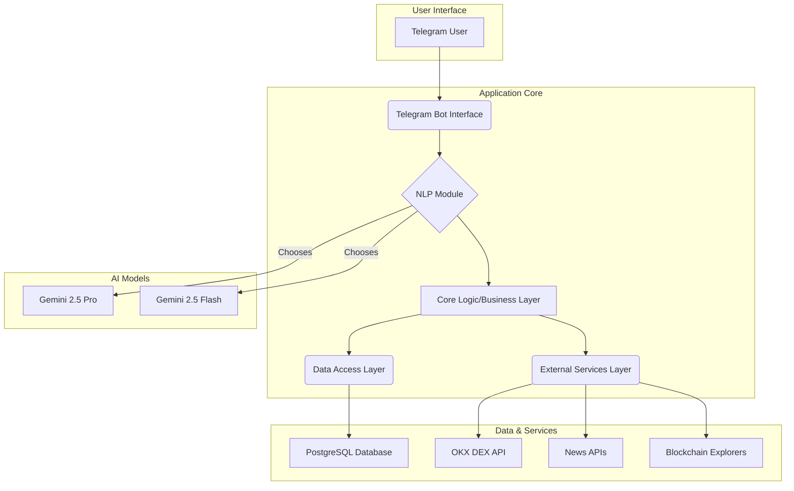

# How It Works: A Technical Deep Dive into Esther

## 1. Introduction
This document provides a detailed technical explanation of Esther's architecture, data flow, and core components. It is intended for developers and technical stakeholders to understand the inner workings of the system.

## 2. Architectural Overview
Esther is a modular, asynchronous Python application designed for scalability and maintainability. The architecture separates concerns into distinct layers, ensuring that each part of the system has a single responsibility.

## 3. Data Flow: A User Command's Journey

Here is the step-by-step journey of a user command, from Telegram to execution and back:

1.  **Message Reception**: The **Telegram Bot Interface**, running asynchronously, receives a message from a user.
2.  **NLP Processing**: The message is passed to the **NLP Module**.
    *   A preliminary check determines the likely complexity of the query.
    *   **Strategy Pattern**: Based on complexity, the system selects either **Gemini Flash** (for simple requests like "price of ETH") or **Gemini Pro** (for complex requests like "buy 0.5 ETH if...").
    *   The chosen Gemini model processes the text, returning a structured object containing the user's `intent` (e.g., `buy_token`) and `entities` (e.g., `{token: 'ETH', amount: 0.5, currency: 'USDT'}`).
3.  **Core Logic Orchestration**: The **Core Logic Layer** receives the structured `intent` and `entities`.
    *   It retrieves the user's profile and encrypted API keys from the **PostgreSQL Database** via the **Data Access Layer**.
    *   **Command Pattern**: It instantiates a command object (e.g., `BuyCommand`) with the necessary data.
4.  **Pre-execution & Confirmation**:
    *   For transactional commands, the Core Logic Layer first calls the **External Services Layer** to fetch any required data (e.g., current price, estimated fees from the **OKX DEX API**).
    *   It constructs a clear, human-readable confirmation message (e.g., "You are about to buy 0.5 ETH for approximately 1000 USDT. Confirm?").
    *   This message is sent back to the user through the Telegram Bot Interface. The system then waits for the user's confirmation.
5.  **Execution**:
    *   Upon receiving confirmation, the Core Logic Layer executes the command.
    *   The `BuyCommand` object calls the **External Services Layer**.
    *   **Dry Run Mode**: By default, the system operates in a simulation mode. It will construct and send a request to get a live quote from the **OKX DEX API**, but it will **not** send a final transaction to be executed on the blockchain.
6.  **Response and Logging**:
    *   The result of the quote API call is received.
    *   A final status message is sent to the user (e.g., "Trade executed successfully" or "Trade failed: Insufficient funds").
    *   The transaction details are logged in the **PostgreSQL Database** for the user's history.

## 4. Gemini Model Allocation Strategy
The choice between Gemini Pro and Flash is dynamic and crucial for balancing performance and cost.

-   **Gemini Flash is used for**:
    -   Initial greetings and simple conversational turns.
    -   Single-intent, low-complexity queries: "What is the price of BTC?", "What is DeFi?".
    -   Simple, single-condition alerts: "Alert me if BTC > $70,000".
-   **Gemini Pro is used for**:
    -   Complex, multi-intent, or conditional commands: "Buy 0.1 ETH with USDT if the price is below $2000".
    -   In-depth market analysis and trend generation.
    -   Personalized recommendations that require analyzing user history and portfolio data.
    -   Nuanced sentiment analysis of news articles.
    -   Generating detailed, structured educational content.

## 5. Security Design
Security is paramount. The following measures are integral to the design:
-   **Environment Variables**: All system-level API keys and secrets are managed exclusively through environment variables and are never hardcoded.
-   **Database Encryption**: User-specific sensitive data, particularly OKX DEX API keys, are encrypted using a strong algorithm (e.g., AES-256) before being stored in the PostgreSQL database. The encryption key itself is managed as a secure environment variable.
-   **Immutable Transaction Confirmation**: The pre-execution confirmation step is a mandatory, non-skippable part of the workflow for any action that modifies a user's assets.
-   **Principle of Least Privilege**: The OKX DEX API keys requested from the user should have the minimum required permissions for the bot's functionality.
