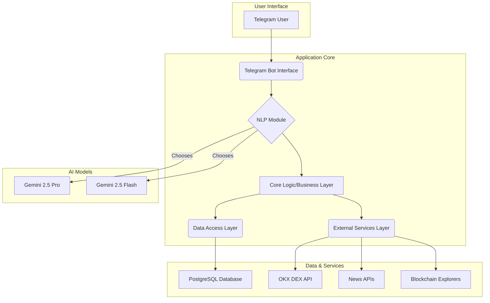

# How It Works: A Technical Deep Dive into Esther

## 1. Introduction
This document provides a detailed technical explanation of the Esther AI Agent's architecture, data flow, and core components. It is intended for developers and technical stakeholders to understand the inner workings of the system.

## 2. Architectural Overview
Esther is a modular, asynchronous Python application designed for scalability and maintainability. The architecture separates concerns into distinct layers, ensuring that each part of the system has a single responsibility.

## 3. Data Flow: A User Command's Journey

Here is the step-by-step journey of a user command, from Telegram to execution and back:

1.  **Message Reception**: The **Telegram Bot Interface**, using a long-polling mechanism, receives a message from a user. This is managed by the `python-telegram-bot` library's `Application.run_polling()` method.
2.  **NLP Processing**: The message is passed to the **NLP Module**.
    *   A preliminary check determines the likely complexity of the query.
    *   **Strategy Pattern**: Based on complexity, the system selects either **Gemini Flash** (for simple requests like "price of ETH") or **Gemini Pro** (for complex requests like "buy 0.5 ETH if...").
    *   The chosen Gemini model processes the text, returning a structured object containing the user's `intent` (e.g., `buy_token`, `sell_token`, `set_stop_loss`) and `entities` (e.g., `{token: 'ETH', amount: 0.5, currency: 'USDT'}`).
3.  **Core Logic Orchestration**: The **Core Logic Layer** receives the structured `intent` and `entities`.
    *   It retrieves the user's profile and encrypted API keys from the **PostgreSQL Database** via the **Data Access Layer**.
    *   **Command Pattern**: It instantiates a command object (e.g., `BuyCommand`) with the necessary data.
4.  **Pre-execution & Confirmation (Conversation Flow)**:
    *   For transactional commands like `buy_token` or `sell_token`, the **Core Logic Layer** initiates a multi-step conversation using Telegram's `ConversationHandler`.
    *   **Quote Fetch**: It first calls the **External Services Layer** to get a live quote from the **OKX DEX API**. For cross-chain swaps, it includes the `source_chain` and `destination_chain` in the request. The `source_chain` is used to determine the `chainId` for the API call. This ensures the user sees up-to-date pricing.
    *   **Confirmation Prompt**: A detailed confirmation message is constructed, including the estimated amount of the token to be received and the source and destination chains. This message is sent to the user with inline keyboard buttons ("✅ Confirm", "❌ Cancel").
    *   **State Management**: The `ConversationHandler` transitions the user's chat into a specific state (`AWAIT_CONFIRMATION`). In this state, the bot will only listen for the user to click one of the confirmation buttons. The details of the pending swap are stored in the `context.user_data` dictionary to maintain state.
5.  **Execution**:
    *   **User Action**: The user clicks either "Confirm" or "Cancel".
    *   **Callback Handling**: A `CallbackQueryHandler` captures the user's choice.
    *   **Swap Execution**: If the user confirms, the `confirm_swap` function is called. It retrieves the swap details from `context.user_data` and calls the `execute_swap` method in the **External Services Layer**.
    *   **Dry Run vs. Live Mode**: The `DRY_RUN_MODE` flag determines the outcome.
        *   If `True`, a simulated swap is performed by fetching a final quote.
        *   If `False`, a real transaction is executed by sending a signed request to the `/api/v5/dex/aggregator/swap` endpoint of the **OKX DEX API**.
    *   **Cancellation**: If the user cancels, the `cancel_swap` function is called, the conversation ends, and the stored swap details are cleared.
6.  **Response and Logging**:
    *   The result of the quote API call is received.
    *   A final status message is sent to the user (e.g., "Trade executed successfully" or "Trade failed: Insufficient funds").
    *   The transaction details are logged in the **PostgreSQL Database** for the user's history.
7.  **Background Monitoring (Price Alerts)**:
    *   A separate, continuously running process (`src/monitoring.py`) handles real-time price alerts.
    *   **Periodic Checks**: Every 60 seconds, this process queries the `alerts` table in the **PostgreSQL Database** for all active alerts.
    *   **Live Price Fetch**: For each active alert, it calls the **OKX DEX API** to get the current price of the monitored token.
    *   **Condition Check**: It compares the live price against the alert's target price and condition (e.g., `current_price > target_price`).
    *   **Notification**: If an alert is triggered, the monitoring service uses the **Telegram Bot API** to send a direct message to the user.
    *   **Deactivation**: Once an alert is triggered, it is marked as inactive in the database to prevent duplicate notifications.

## 4. Gemini Model Allocation Strategy
The choice between Gemini Pro and Flash is dynamic and crucial for balancing performance and cost.

-   **Gemini Flash is used for**:
    -   Initial greetings and simple conversational turns.
    -   Single-intent, low-complexity queries: "What is the price of BTC?", "What is DeFi?".
    -   Simple, single-condition alerts: "Alert me if BTC > $70,000".
-   **Gemini Pro is used for**:
    -   Complex, multi-intent, or conditional commands: "Buy 0.1 ETH with USDT if the price is below $2000".
    -   In-depth market analysis and trend generation.
    -   Personalized recommendations that require analyzing user history and portfolio data.
    -   Nuanced sentiment analysis of news articles.
    -   Generating detailed, structured educational content.

## 5. Security Design
Security is paramount. The following measures are integral to the design:
-   **Environment Variables**: All system-level API keys and secrets are managed exclusively through environment variables and are never hardcoded.
-   **Database Encryption**: User-specific sensitive data, particularly OKX DEX API keys, are encrypted using a strong algorithm (e.g., AES-256) before being stored in the PostgreSQL database. The encryption key itself is managed as a secure environment variable.
-   **Immutable Transaction Confirmation**: The pre-execution confirmation step is a mandatory, non-skippable part of the workflow for any action that modifies a user's assets.
-   **Principle of Least Privilege**: The OKX DEX API keys requested from the user should have the minimum required permissions for the bot's functionality.
